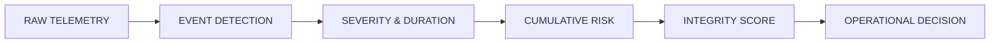
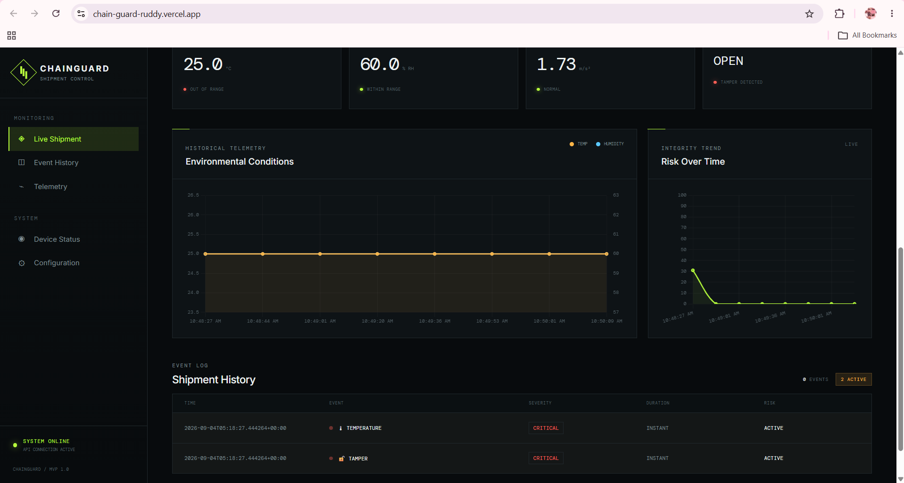
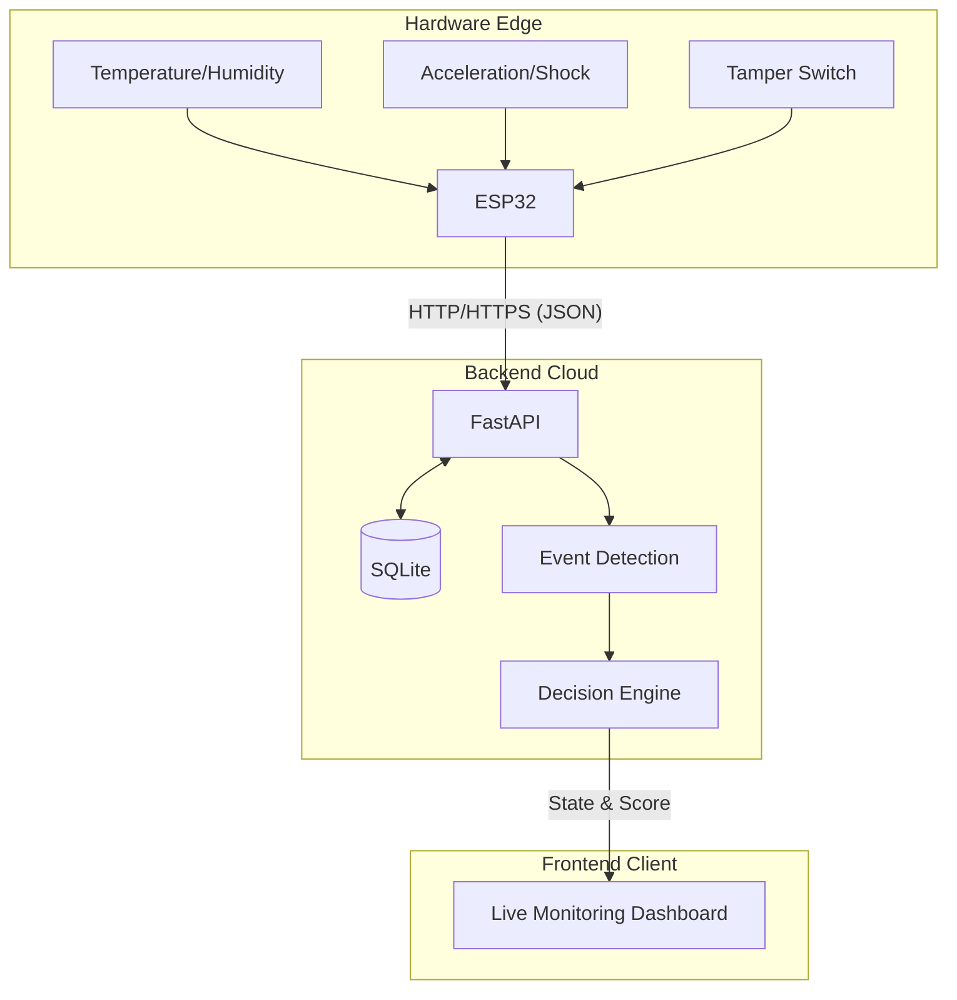

<div align="center">

# ChainGuard
### The Digital Black Box for Sensitive Shipments

[](https://www.python.org/)
[](https://fastapi.tiangolo.com/)
[](#)
[](https://www.sqlite.org/)
[](https://developer.mozilla.org/)
[](https://chain-guard-ruddy.vercel.app/)
[](https://github.com/ananyajoshi-cseai/ChainGuard)

An IoT-powered shipment condition monitoring and decision-support prototype built by **Team Diazonium**.

</div>

---

## 📌 Project Overview

A shipment may arrive at its destination without obvious external damage, while its journey may have included environmental excursions, shocks, or tampering. Traditional tracking answers *"Where is the package?"*

**ChainGuard** is designed to help answer:
*"What happened to the package during the journey, and does its condition warrant inspection?"*

ChainGuard is an IoT-based system that uses a compact ESP32 device traveling inside a shipment to monitor temperature, humidity, acceleration (shock), and enclosure tampering. However, ChainGuard does not simply stream raw sensor values. It features a backend decision engine that processes telemetry into actionable operational decisions.

### From Raw Telemetry to a Decision

The core value of ChainGuard is its data processing pipeline:


## 🚀 Live Demo & Links

- **Live Dashboard (Frontend):** [https://chain-guard-ruddy.vercel.app/](https://chain-guard-ruddy.vercel.app/)
- **Backend API Base:** [https://chainguard-qpy6.onrender.com/](https://chainguard-qpy6.onrender.com/)
- **Swagger / API Docs:** [https://chainguard-qpy6.onrender.com/docs](https://chainguard-qpy6.onrender.com/docs)
- **API Health Check:** [https://chainguard-qpy6.onrender.com/health](https://chainguard-qpy6.onrender.com/health)
- **GitHub Repository:** [https://github.com/ananyajoshi-cseai/ChainGuard](https://github.com/ananyajoshi-cseai/ChainGuard)

## 📸 Visual Overview & Reference Links

<br>

### 🖥️ Live Monitoring Dashboard

The web dashboard provides real-time tracking of the shipment's integrity score, risk analysis, and raw sensor conditions.


<br>

Historical telemetry, event logs, and active condition excursions are visualized on the tracking timeline.



<br>
<br>

### 🔌 Hardware Circuit & Simulation

Before physical deployment, the ESP32-based hardware edge was architected and tested using Cirkit Designer. 


<br>


<br>

The simulation console demonstrates the ESP32 successfully polling sensors and transmitting JSON payloads to the backend API.


<br>
<br>

## ⚙️ Core Architecture

The complete system flow is: **SENSE → COLLECT → TRANSMIT → PROCESS → EVALUATE → DECIDE**


## 🛠️ Components

### 1. Hardware (IoT Edge)
The prototype uses an ESP32 microcontroller to collect environmental data and transmit it via Wi-Fi.
- **Microcontroller:** ESP32 / ESP32-S3
- **Sensors:** 
  - DHT11 (Temperature & Humidity)
  - MPU6050 (Acceleration/Shock)
  - Reed Switch / Digital Input (Tampering)
- **Firmware:** Located in `hardware/chainguard_esp32.ino`. It polls sensors and POSTs JSON telemetry to the backend API.

### 2. Backend (FastAPI + Decision Engine)
A Python-based backend that handles data ingestion, state management, and the core logic.
- **Framework:** FastAPI, Uvicorn, Pydantic
- **Database:** SQLite (Stores telemetry, event history, active events, and shipment state)
- **Event Lifecycle:** The `event_detector.py` manages the state machine for environmental excursions. It detects when an abnormal condition begins, tracks its active duration, and logs it when the condition normalizes. Shocks use a frequency/cooldown mechanism to prevent duplicate events.

### 3. Frontend (Live Dashboard)
A lightweight, responsive web interface built with HTML, CSS, Vanilla JavaScript, and Chart.js.
- Deployed on Vercel.
- Polls the backend to visualize current decision state, real-time sensor charts, event history timelines, and risk contribution breakdowns.

---

## 🧠 The Decision Engine

This module (`decision_engine.py`) calculates the shipment's **Integrity Score** and final state based on configurable prototype thresholds and weights.

### Thresholds (MVP Configuration)
*Note: These are configurable prototype values for demonstration, not validated regulatory standards.*

| Parameter | Normal | Severity 1 | Severity 2 | Severity 3 |
| :--- | :--- | :--- | :--- | :--- |
| **Temperature** | 2–8°C | 0–2°C / 8–10°C | -2–0°C / 10–15°C | Other |
| **Humidity** | 30–70% | 20–30% / 70–80% | 10–20% / 80–90% | Other |
| **Shock (m/s²)**| $\le 2.5$ | $\le 4.0$ | $\le 6.0$ | $> 6.0$ |
| **Tamper** | 0 | - | - | 1 |

### Risk Calculation
The engine assigns base weights to different metrics:
- Tamper = 15
- Temperature = 8
- Shock = 7
- Humidity = 3

Risk is calculated dynamically using **duration multipliers** (for sustained temperature/humidity excursions) and **frequency multipliers** (for repeated shocks).

### Integrity Score & Final Decision
The cumulative risk is subtracted from 100 to yield the **Integrity Score**. 

* **ACCEPT** (Score $\ge 80$)
* **INSPECT** (Score $\ge 50$)
* **HIGH RISK** (Score $< 50$)

---

## 🔌 API Endpoints

The FastAPI backend exposes the following endpoints:

- `GET /` - Root status message.
- `GET /health` - API health check.
- `POST /api/telemetry` - Ingests JSON payload from ESP32, updates events, recalculates risk, and returns the new shipment state.
- `GET /api/telemetry/latest/{shipment_id}` - Retrieves the most recent telemetry reading.
- `GET /api/telemetry/{shipment_id}` - Retrieves historical telemetry data.
- `GET /api/events/{shipment_id}` - Lists all completed events for a shipment.
- `GET /api/events/{shipment_id}/active` - Lists currently ongoing condition excursions.
- `GET /api/shipments/{shipment_id}/summary` - Returns a comprehensive view of the shipment's current state, Integrity Score, active events, and recent telemetry.

**Example Telemetry POST Payload:**
```json
{
  "shipment_id": "CG-1042",
  "temperature": 5.4,
  "humidity": 58.0,
  "acceleration": 1.72,
  "tamper_status": 0
}
```
## 💻 Local Setup & Development

### Prerequisites
- Python 3.9+
- Git

### Installation

1. **Clone the repository:**
   
```bash
   git clone [https://github.com/ananyajoshi-cseai/ChainGuard.git](https://github.com/ananyajoshi-cseai/ChainGuard.git)
   cd ChainGuard
```
2. **Set up the Python Virtual Environment:**
   
```bash
   python -m venv .venv
```
*Activate on Windows PowerShell:*
   
```powershell
   .venv\Scripts\Activate.ps1
```
*Activate on macOS/Linux:*
   
```powershell
   source .venv/bin/activate
```
3. **Install Backend Dependencies:**
   
```bash
   cd backend
   pip install -r requirements.txt
```
4. **Run the Backend Server:**
   
```bash
   uvicorn main:app --reload
```
The backend will run at `http://127.0.0.1:8000`. API docs are at `http://127.0.0.1:8000/docs`.

5. **Run the Frontend locally:**
   Open `frontend/index.html` using a local development server (like the VS Code Live Server extension). 
   *Note: To test with a local backend, ensure the `API_BASE` variable in `script.js` points to your `localhost:8000` address instead of the Render deployment.*

---

## 📂 Repository Structure

```text
ChainGuard/
├── backend/
│   ├── main.py              # FastAPI application, endpoints, ingestion flow
│   ├── database.py          # SQLite schema, storage, and state management
│   ├── decision_engine.py   # Severity, risk, and Integrity Score logic
│   ├── event_detector.py    # Active/completed event lifecycle management
│   └── requirements.txt     # Python dependencies
│
├── frontend/
│   ├── index.html           # Dashboard UI structure
│   ├── script.js            # API integration, charts, state management
│   └── style.css            # Dashboard styling
│
├── hardware/
│   └── chainguard_esp32.ino # ESP32 C++ firmware for sensor polling & HTTP POST
│
├── .gitignore
└── README.md
```
## 🎯 Current MVP Status

The following features are currently implemented and functional in the prototype:
- Complete ESP32 $\rightarrow$ Deployed Backend telemetry flow via HTTP.
- SQLite-based storage for telemetry and event history.
- State-machine detection for temperature, humidity, shock, and tamper events.
- Active $\rightarrow$ Completed event lifecycle tracking.
- Severity-based, duration-aware, and frequency-aware risk calculation.
- Cumulative Integrity Score rendering one of three decisions (ACCEPT / INSPECT / HIGH RISK).
- Backend-driven risk breakdown generation.
- Live, auto-refreshing dashboard with real-time charts and event timelines.
- Cloud deployment (Vercel for frontend, Render for backend).

---

## 🔭 Future Scope

Features beyond the current hackathon MVP scope:
- GPS / route tracking integration.
- Cellular (GSM/LTE-M) connectivity for transit without Wi-Fi.
- Local microSD buffering for offline data logging.
- Migration to a persistent cloud database (e.g., PostgreSQL).
- Advanced anomaly detection using machine learning.
- Immutable/tamper-evident audit trails (blockchain/cryptographic hashing).
- Multi-shipment fleet monitoring dashboard.
- Configurable thresholds specific to individual shipments.
- Battery optimization for long-haul journeys.

---

## 👥 Team Diazonium

- **Ananya Joshi** — Frontend + Backend + Deployment
- **Vaibhav** — Documentation + Pitch
- **Utkarsh** — Decision Engine + Mathematical Model
- **Unnat** — Hardware + ESP32 Integration

---
